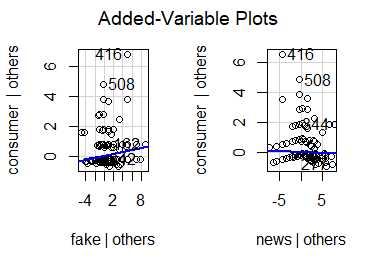

---
author:
- Dr. Kamakshaiah Musunuru
title: "`easytm`: An easy way to text mining in R."
---

[^1]

# Abstract {#abstract .unnumbered}

The `easytm` script for R simplifies text mining by automating
repetitive tasks like managing paths, creating data frame subsets, and
setting up directories, tasks that are time-consuming and often
frustrating when using traditional functions. The script can be
implemented with the command `source(easytm.R)` in the R console, the
script was demonstrated using two types of inputs: text processed in the
R console and from files. For illustration, 539 abstracts from Scopus
were processed with the search query "marketing is fake", data retrieved
on June 30, 2024. The processed data underwent multiple regression
analysis, revealing that for the *consumer* response, the variable
*fake* had a significant positive effect, while *news* did not. For the
satisfaction response, neither *fake* nor *news* had a significant
effect. These findings indicate that while *fake* is significantly
associated with the consumer response, it does not significantly impact
satisfaction, and overall, the predictors explain only a small portion
of variability in the responses.

# Background

R is a versatile and powerful tool for text mining, offering a range of
packages that enable users to process, analyze, and visualize textual
data. Some of the most prominent R packages for text mining include
`tm`, `quanteda`, `tidytext`, and `text2vec`.

The `tm` (Text Mining) package provides a comprehensive framework for
text mining applications within R.[@18][@19] It facilitates text
preprocessing tasks such as stemming, tokenization, and the creation of
document-term matrices, which are essential for further text analysis.
The 'tm' package's structure allows for easy manipulation and
transformation of text data, making it a popular choice for researchers
and analysts.

`Quanteda` (Quantitative Analysis of Textual Data) is another robust
package designed for the management and quantitative analysis of textual
data.[@20] It offers a user-friendly interface and supports complex text
analysis tasks such as keyword extraction, document similarity measures,
and the creation of feature matrices. `Quanteda` is particularly
well-suited for large-scale text analysis due to its efficient handling
of large text corpora and its integration with other R packages.

`Tidytext` brings the principles of tidy data to text mining, allowing
for seamless integration with the `dplyr` and `ggplot2` packages.[@21]
It enables users to perform text mining tasks using tidy data
principles, making the text analysis process more intuitive and easier
to manage. `Tidytext` excels in sentiment analysis, word frequency
analysis, and topic modeling, making it an excellent choice for
exploratory text data analysis.

Finally, `text2vec` is a package designed for scalable text mining,
offering tools for creating word embeddings, text classification, and
topic modeling.[@22] It focuses on performance and scalability, allowing
users to process and analyze large text datasets efficiently. `text2vec`
integrates well with machine learning algorithms, making it a suitable
choice for advanced text mining applications. Together, these R packages
provide a robust toolkit for text mining, catering to a wide range of
analysis needs from basic preprocessing to advanced machine learning
applications.

## `easytm`

R offers many ways to text mining and packages like `tm` makes it pretty
easy. The `tm` package has functions for mining data from a given input
corpus. However, there are a few trivial tasks such as managing paths,
creating subsets of data frames which are repetitive, routine and
tiring. For instance, we may have to create a couple of directories one
for scripts, the other for outputs so on and so forth. Such jobs
consumes lot of time and often leaves the day with frustration.

The script `easytm` helps the users performing trivial tasks rather
painlessly. No need to use `readlines()` for paths, `grep()`, for
sub-setting data sets, and `file.path()` for making file paths etc. The
script is easy for implementation, just execute `source(easytm.R)` in R
console to use it for data mining and analysis. [^2] *It's free,
however, no guarantee or warranties are applied for any damages or
losses of what-so-ever, users discretion is advised and required*.

## Natural Language Processing (NLP)

In Natural Language Processing (NLP), word vectors are data-driven
representations of words crucial for various tasks. Term
Frequency-Inverse Document Frequency (TF-IDF) vectors are used to
represent documents based on word frequencies.[@1] [@2]Document-Term
Matrix (DTM) is a matrix where rows represent documents, columns
represent terms, and cells contain the frequency of each term in each
document. [@3] TF-IDF is a common technique for text analytics, creating
a sparse matrix of term frequencies.[@4] In contrast, word vectors are
dense representations of words, often derived from linguistic resources
like WordNet, enhancing interpretability and performance in NLP tasks.
[@5] These vectors capture semantic relationships and are essential for
tasks like document genre classification and disaster tweet
classification.[@6]

Term vectors can be treated as observed variables for statistical
analysis. When textual data is converted into term vectors, these
vectors represent numerical representations of the text, which can be
analyzed using various statistical methods.[@14] [@15] Term vectors can
be treated as study variables, especially in the context of analyzing
the joint dynamics of bond yields and macroeconomic variables.[@7] By
redefining predictor variables as vectors instead of scalars, it becomes
possible to handle variables that are not logically or physically
separable, ensuring mathematical independence and statistical
uncorrelation.[@8] This approach allows for a more comprehensive
analysis of the relationships between different factors, such as
inflation, economic growth, and bond prices, leading to improved
forecasting performance and a better understanding of the dynamics of
the yield curve.[@9] Additionally, vector autoregression models can
provide valuable insights into the interactions between variables,
offering a more complete treatment of policy endogeneity compared to
other modeling strategies10. Therefore, leveraging term vectors as study
variables can enhance the accuracy and depth of economic and financial
analyses.

Statistical analysis can be conducted on Document-Term Matrices (DTMs)
using techniques like Latent Semantic Analysis (LSA) and Correspondence
Analysis (CA).[@11] LSA employs singular value decomposition to reduce
dimensionality and extract important relationships between terms and
documents.[@12] Additionally, incorporating semantic similarities from
resources like WordNet can enhance the analysis, as shown in a study on
similarity-reduced correspondence analysis.[@13]

# R practice

This section demonstrates data mining and analysis through three
different sub-sections viz., a trivial example, a moderate example, and
non-trivial example. The first, explains processing text in paragraphs
assuming each paragraph as a document. Second, explains how to process
data from files, where the text is arranged in different rows, assuming
text in each row represents a document. Third, explains how to process
large amount of data which is obtained from online sources and as
abstracts from certain research documents. As it is mentioned earlier,
you need to execute `source(easytm.R)` in the R console to get all the
functions of the script in to the cache.

## A trivial example

Switching locations is easy using `convertPath()`. This function just
replaces a couple of R base functions i.e.,` readline()` and `gsub()`.

    > getwd()
    [1] "C:/Users/kamak/OneDrive/Documents"
    > path <- convertPath()
    D:\demo
    > setwd(path)
    > getwd()
    [1] "D:/demo"

Let's make text collection. I use two rows i.e., *row1* and *row2* and
let's imagine that these two rows handles text from two independent
documents.

    row1 <- 'Wikipedia is a free online encyclopedia, created 
                        and edited by volunteers around the world and 
                        hosted by the Wikimedia Foundation.'
    row2 <- 'Wikimedia is a global movement whose mission is 
                        to bring free educational content to the world.'

R is known for a special function *data.frame()*, this saves quite a bit
of time while performing analysis on data sets. All the base data
structures such as vectors, factors, etc. need to be converted to data
frame to make the job easy. Let's make the above two rows i.e.,
`row1, row2` into a data frame.

    > df_ <- as.data.frame(rbind(row1, row2))

Now lets check properties of this data frame.

    > is.data.frame(df_)
    [1] TRUE
    > dim(df_)
    [1] 2 1
    [1] "V1"

The data frame is $2 \times 1$ data matrix and the column name is
`"V1"`, that's the default name R assigns to columns when no input is
provided. Let's convert the text into a Document Term Matrix (DTM). That
can be done using `cleanCorpusAndMakeDF()` function in `easytm`.

    > absdf <- cleanCorpusAndMakeDF(df_)
    > names(absdf)
     [1] "around"       "bring"        "content"      "created"      "edited"      
     [6] "educational"  "encyclopedia" "foundation"   "free"         "global"      
    [11] "hosted"       "mission"      "movement"     "online"       "volunteers"  
    [16] "whose"        "wikimedia"    "wikipedia"    "world"  

The output from the statement `names(absdf)` is the list of column names
of the DTM (i.e., `absdf`). This can be verified using
`typeof(), class()` function. These are R base functions.

    > class(absdf)
    [1] "data.frame"
    > typeof(absdf)
    [1] "list"

Performing analysis on this data frame becomes easy now. For instance, a
simple summary for the column "online", assuming it as a variable, can
be done as below.

    > n <- searchWordVec('online', absdf)
      online
    1      1
    2      0
    > summary(absdf[n])
         online    
     Min.   :0.00  
     1st Qu.:0.25  
     Median :0.50  
     Mean   :0.50  
     3rd Qu.:0.75  
     Max.   :1.00

The function `searchWordVec()` makes the task easy while searching for
word vectors.

## A Moderate example

We don't deal with data in console but collect data in files such as
spreadsheets. This section demonstrates the procedure as how data can be
obtained such as the one from Comma Separated Value (*.csv*) file. For
this, I scraped certain Google search data for a query "how to scrape
Google search titles in R" using `rvest` package and the titles were
saved in *gtitles.csv*. [^3][^4]

    > filepath <- convertPath()
    D:\Work\R Scripts\textmining\easytm
    > filepath           
    [1] "D:/Work/R Scripts/textmining/easytm"
    > setwd(filepath)           
    > titles <- importDataFile(filepath = 'gtitles.csv')
    [1] "Doc"
    > titles
                                                        Doc
    1  Web Scraping in R: The Complete Guide 2024 - ZenRows
    2                Scraping Google Search Results Using R
    3                     Web Scraping Google Result with R
    4                                      google-scraper.R
    5            Web Scraping With R: Step-by-Step Tutorial
    6                      Web Scraping Google Scholar in R
    7            Google News Scraping in R - Pieter E. Stek
    8           How to Scrape Google Search Results in 2024
    9                                     Web scraping in R
    10                     Scrapping Google Scholar Using R

The function `importDataFile()` is useful to get data into R.

    > ttlsdf <- cleanCorpusAndMakeDF(titles["Doc"])
    > head(ttlsdf)
      complete google googlescraperr guide news pieter result results scholar scrape
    1        1      0              0     1    0      0      0       0       0      0
    2        0      1              0     0    0      0      0       1       0      0
    3        0      1              0     0    0      0      1       0       0      0
    4        0      0              1     0    0      0      0       0       0      0
    5        0      0              0     0    0      0      0       0       0      0
    6        0      1              0     0    0      0      0       0       1      0
      scraping scrapping search stek stepstep tutorial using web zenrows
    1        1         0      0    0        0        0     0   1       1
    2        1         0      1    0        0        0     1   0       0
    3        1         0      0    0        0        0     0   1       0
    4        0         0      0    0        0        0     0   0       0
    5        1         0      0    0        1        1     0   1       0
    6        1         0      0    0        0        0     0   1       0

No need to use whole bunch of functions of `tm` package for mining. The
function `cleanCorpusAndMakeDF()` replaces half dozen functions of `tm`
package. The function `searchPattern()` can be used for finding patterns
in the data frame. For instance, the pattern, "scrape" can be found in
the DTM as shown below. [^5]

    > n_ <- searchPattern('scrape', ttlsdf)
    [1] "googlescraperr"
    [1] "scrape"
    > names(ttlsdf[n_])
    [1] "googlescraperr" "scrape"        
    > summary(ttlsdf[n_])
     googlescraperr     scrape   
     Min.   :0.0    Min.   :0.0  
     1st Qu.:0.0    1st Qu.:0.0  
     Median :0.0    Median :0.0  
     Mean   :0.1    Mean   :0.1  
     3rd Qu.:0.0    3rd Qu.:0.0  
     Max.   :1.0    Max.   :1.0

There are two variables (TFVs), namely "googlescraperr", "scrape", which
match the pattern "scrape" in the text corpus. Summaries shows that the
maximum occurrence of the factor is one and there are a few tiles where
the presence is zero (Min. 0).

## Non trivial example

This section demonstrates as how data files with significant size can be
processed using `easytm`. There are couple of worthy functions for
obtaining the file, and transform raw text into other formats which are
amenable for analysis. A file consisting of a few abstracts retrieved
from a known database such as Scopus and turning such abstract or
abstracts into a data variables or matrices worthy for investigation. An
abstract is retrieved using a search string "marketing is fake". Google
scholar has retrieved 4,64,000 results in 0.07 seconds. Let us see, how
many times words "marketing" and "fake" were repeated in the very first
abstract.[^6] [@16]

    firstab <- 'There is growing concern amongst policy makers, managers and 
                academic researchers over the role that social media plays in 
                spreading misinformation, widely described as ‘Fake News’. 
                However, research to date has mainly focussed on the implications 
                of fake news for political communication and debate. There has 
                been less focus on the implications of social media misinformation
                upon marketing and consumers. Given the key role of social media 
                as a communication platform, there is a gap in our understanding 
                of fake news through a consumer lens. We address this gap by 
                conducting an interdisciplinary systematic review of the relevant 
                literature. Through critical evaluation and synthesis of the 
                literature, we identify five themes that explain the fake news 
                phenomenon: the dissemination process, spreading channel features, 
                outcomes, fabricated legitimacy and attitudes. Finally, 
                we propose a theoretical framework that highlights themes’ 
                relationships and research propositions to guide future research 
                in this area.'
    > apf <- convertAbstractToDataSet(firstab)
    > n1 <- searchWordVec('market', abf)
            Var1 Freq
    59 marketing    1
    > n2 <- searchWordVec('fake', abf)
       Var1 Freq
    29 fake    3
    > abf[c(n1, n2), ]
            Var1 Freq
    59 marketing    1
    29      fake    3

The output for `convertAbstractToDataSet()` is a data frame. The first
column (Var1) is a vector of words (Freq) and the second column has the
frequencies for each word in the first column. The word *fake* repeated
3 times in the abstract but the other word marketing occured or
mentioned only one time. Hence, it is clear that there is more emphasis
on "fake" than "marketing" by the authors in this research article.
Let's do the same exercise for the second abstract.[@17]

    > secondab <- 'We study the market for fake product reviews on Amazon.com. 
    +               Reviews are purchased in large private groups on Facebook 
    +               and other sites. We hand-collect data on these markets and 
    +               then collect a panel of data on these products’ ratings 
    +               and reviews on Amazon, as well as their sales rank, 
    +               advertising, and pricing policies. We find that a wide 
    +               array of products purchase fake reviews, including products 
    +               with many reviews and high average ratings. Buying fake 
    +               reviews on Facebook is associated with a significant but 
    +               short-term increase in average rating and number of reviews. 
    +               We exploit a sharp but temporary policy shift by Amazon to 
    +               show that rating manipulation has a large causal effect on 
    +               sales. Finally, we examine whether rating manipulation harms 
    +               consumers or whether it is mainly used by high-quality 
    +               products in a manner like advertising or by new products 
    +               trying to solve the cold-start problem. We find that after 
    +               firms stop buying fake reviews, their average ratings fall 
    +               and the share of one-star reviews increases significantly, 
    +               particularly for young products, indicating rating manipulation 
    +               is mostly used by low-quality products.'
    > abs <- convertAbstractToDataSet(secondab)
    > abs <- cleanData(abs)
    > n3 <- searchWordVec('market', abs)
          Var1 Freq
    55  market    1
    56 markets    1
    > n4 <- searchWordVec('fake', abs)
       Var1 Freq
    29 fake    4
    > abs[c(n3, n4), ]
          Var1 Freq
    55  market    1
    56 markets    1
    29    fake    4

You can clean the data frame and avoid a few unwanted terms or other
characters using `cleanData()`. The function `cleanData()` works based
on object `preps` in the script. This object is collection of a few
unwanted words.[^7] The function `plotWordVec()` is useful to make text
plot.[1](#wvp){reference-type="ref" reference="wvp"}

    plotWordVec(clnab[, 2], lbls = clnab[, 1])

{#wvp}

It is also possible to compare insights from two different documents.

    > makeDfFromWord('fake', clnabf, clnabs)
       Var1 Freq
    d1 fake    3
    d2 fake    4

Di Domenico et al. (2021),[@16] mentioned the word "fake" less number of
times compared to He et al., (2022)[@17].

### Processing large data sets

This section demonstrates how to process data from files where the text
is kept in a few rows each row representing a document. For the purpose
of demonstration certain text was retrieved from Scopus against the
search string or query "*marketing is fake*". Scopus retrieved 539
abstracts and the the data was obtained in CSV file.[^8] Following is
the procedure to make DTM from the data.

    abs <- makeAbstracts(dataf)
    absdf <- cleanCorpusAndMakeDF(abs, 0.99)

The object `absdf` is a data frame. It is possible to check column names
with `names(absdf)`.

## Simple and multiple linear regression

The the output for the function `cleanCorpusAndMakeDF()` is a data
frame. It is possible to perform any type of analysis on such objects.
For instance, it is possible to check for factors (patterns) using
`searchVariable()`.

    > markdf <- searchVariable('marketing', absdf)
     [1] "brandingmarketing"   "consultingmarketing" "emarketing"         
     [4] "loyaltymarketing"    "macromarketing"      "marketing"          
     [7] "marketingâ.."        "marketingcentered"   "marketingrelated"   
    [10] "marketingtourism"    "maskmarketing"       "massmarketing"      
    [13] "postmarketing"      
    > dim(markdf)
    [1] 539  13

The data frame `markdf` in the above code is a data frame for pattern
*marekting*. This pattern can be explained with the help of 13 such
manifest/observed variables in the data. For instance, the impact of
*fake news* on *consumer satisfaction* can be measured using simple
linear regression.

    > cons <- searchVariable('consumer', absdf)
    > sat <- searchVariable('satisfaction', absdf)
    > fake <- searchVariable('fake', absdf)
    > news <- searchVariable('news', absdf)

    > regdf <- data.frame(cons, sat, fake, news)
    > lm(cbind(consumer, satisfaction)~ fake + news, data = regdf)

    Call:
    lm(formula = cbind(consumer, satisfaction) ~ fake + news, data = regdf)

    Coefficients:
                 consumer    satisfaction
    (Intercept)   0.1094246   0.0122001  
    fake          0.0686780  -0.0013049  
    news         -0.0103889  -0.0008727

The impact of *fake news* seems to be negative on *consumer
satisfaction*.

    > lmfit <- lm(cbind(consumer, satisfaction)~ fake + news, data = regdf)
    > summary(lmfit)
    Response consumer :

    Call:
    lm(formula = consumer ~ fake + news, data = regdf)

    Residuals:
        Min      1Q  Median      3Q     Max 
    -0.9047 -0.1781 -0.1781 -0.1094  6.4785 

    Coefficients:
                Estimate Std. Error t value Pr(>|t|)    
    (Intercept)  0.10942    0.03818   2.866 0.004317 ** 
    fake         0.06868    0.01977   3.474 0.000555 ***
    news        -0.01039    0.01785  -0.582 0.560747    
    ---
    Signif. codes:  0 ‘***’ 0.001 ‘**’ 0.01 ‘*’ 0.05 ‘.’ 0.1 ‘ ’ 1

    Residual standard error: 0.6751 on 536 degrees of freedom
    Multiple R-squared:  0.03233,   Adjusted R-squared:  0.02871 
    F-statistic: 8.953 on 2 and 536 DF,  p-value: 0.0001498

    Response satisfaction :

    Call:
    lm(formula = satisfaction ~ fake + news, data = regdf)

    Residuals:
         Min       1Q   Median       3Q      Max 
    -0.01220 -0.01090 -0.01090 -0.00915  0.98910 

    Coefficients:
                  Estimate Std. Error t value Pr(>|t|)  
    (Intercept)  0.0122001  0.0054311   2.246   0.0251 *
    fake        -0.0013049  0.0028127  -0.464   0.6429  
    news        -0.0008727  0.0025390  -0.344   0.7312  
    ---
    Signif. codes:  0 ‘***’ 0.001 ‘**’ 0.01 ‘*’ 0.05 ‘.’ 0.1 ‘ ’ 1

    Residual standard error: 0.09604 on 536 degrees of freedom
    Multiple R-squared:  0.001897,  Adjusted R-squared:  -0.001827 
    F-statistic: 0.5095 on 2 and 536 DF,  p-value: 0.6011

The negative impact of *fake* on consumers is significant in the
literature. Moreover, the *fake news* impact *consumer satisfaction*
negatively but such discussions does not appear to be significant in
literature. See the Figure [2](#fnews){reference-type="ref"
reference="fnews"} for visualization for regression analysis and the
impact of fake news on consumers.

{#fnews}

# Conclusion

R offers numerous tools for text mining, with packages like `tm`
streamlining the process of mining data from input corpora. However,
repetitive tasks such as managing paths, creating data frame subsets,
and setting up directories can be time-consuming and frustrating. The
`easytm` script addresses these issues by automating trivial tasks,
eliminating the need for functions like `readlines()`, `grep()`, and
`file.path()`. Users can easily implement it by executing
`source(easytm.R)` in the R console.

The script is demonstrated for two type of inputs i.e., processing text
in the R console and also from files. For demonstration purpose, 539
abstracts were obtained from Scopus for certain search query *marketing
is fake* on 30th June, 2024. The abstracts were processed using various
functions of `easytm` and explained data analysis using multiple
regression. Resuts shows taht, for the *consumer* response, the variable
*fake* has a significant positive effect, while *news* does not have a
significant impact. For the *satisfaction* response, neither *fake* nor
news show a significant effect. The models overall indicate that the
predictors explain only a small portion of the variability in the
responses, with *consumer* showing some significant association with
*fake*, but *satisfaction* not showing significant association with
either predictor.

::: thebibliography
Wei, Li., Brian, Mak. (2017). Derivation of Document Vectors from
Adaptation of LSTM Language Model. doi: 10.18653/V1/E17-2073. Wei, Li.,
Brian, Kan., Wing, Mak. (2016). Recurrent Neural Network Language Model
Adaptation Derived Document Vector.. arXiv: Computation and Language.
Kaustubh, Keshav. (2022). Term Frequency Based Approach for Binary
Classi?cations on Short Sentences. International Journal For Science
Technology And Engineering, doi: 10.22214/ijraset.2022.47151 Samah,
Senbel. (2021). Fast and Memory-Efficient TFIDF Calculation for Text
Analysis of Large Datasets. doi: 10.1007/978-3-030-79457-6_47 Manaal,
Faruqui., Chris, Dyer. (2015). Non-distributional Word Vector
Representations. arXiv: Computation and Language, Guillaume, Desagulier.
(2019). Can word vectors help corpus linguists. Studia Neophilologica,
doi: 10.1080/00393274.2019.1616220. Andrew, Ang., Andrew, Ang., Monika,
Piazzesi., Monika, Piazzesi. (2001). A No-Arbitrage Vector
Autoregression of Term Structure Dynamics with Macroeconomic and Latent
Variables. Research Papers in Economics, John, R., Freeman., John, T.,
Williams., Tse-min, Lin. (1989). Vector Autoregression and the Study of
Politics. American Journal of Political Science, doi: 10.2307/2111112.
H., T., Mcadams., R., W., Crawford., G., R., Hadder. (2000). A vector
approach to regression analysis and its application to heavy-duty diesel
emissions. SAE transactions, doi: 10.4271/2000-01-1961. Peter, Reusens.,
Christophe, Croux. (2015). Real or nominal variables, does it matter for
the impulse response?. Social Science Research Network, doi:
10.2139/SSRN.2577815. Dr., Deepali, , Jadhav, -Jagtap. (2023). A
comparison of latent semantic analysis and correspondence analysis of
document-term matrices. Natural Language Engineering, doi:
10.1017/s1351324923000244. Fahrettin, Horasan., Hasan, Erbay., Fatih,
Varçın., Emre, Deniz. (2019). Alternate Low-Rank Matrix Approximation in
Latent Semantic Analysis. Scientific Programming, doi:
10.1155/2019/1095643. Mattia, Egloff., François, Bavaud. (2018). Taking
into account semantic similarities in correspondence analysis. Blei, D.
M., Ng, A. Y., & Jordan, M. I. (2003). Latent Dirichlet Allocation.
Journal of Machine Learning Research, 3, 993-1022. Dumais, S. T. (2004).
Latent semantic analysis. Annual Review of Information Science and
Technology, 38(1), 188-230. https://doi.org/10.1002/aris.1440380105. Di
Domenico, G., Sit, J., Ishizaka, A., & Nunan, D. (2021). Fake news,
social media and marketing: A systematic review. Journal of Business
Research, 124, 329-341. He, S., Hollenbeck, B., & Proserpio, D. (2022).
The market for fake reviews. Marketing Science, 41(5), 896-921.
Feinerer, I., Hornik, K., & Feinerer, M. I. (2015). Package 'tm'.
Corpus, 10(1). Feinerer, I. (2013). Introduction to the tm Package Text
Mining in R. Accessible en ligne: http://cran. r-project.
org/web/packages/tm/vignettes/tm. pdf. Benoit, K., Watanabe, K., Wang,
H., Nulty, P., Obeng, A., Müller, S., & Matsuo, A. (2018). quanteda: An
R package for the quantitative analysis of textual data. Journal of Open
Source Software, 3(30), 774-774. Fay, C. (2018). Text mining with R: a
tidy approach. Journal of Statistical Software, 83, 1-3. Hellín, C. J.,
Valledor, A., Usero, L., Cuadrado-Gallego, J. J., Tayebi, A., & Gómez,
J. (2023). A Comparative Study on R Packages for Text Mining. IEEE
Access.
:::

[^1]: Dr. Kamakshaiah Musunuru, an academic of data science and
    analytics and freelance trainer of enterprise solutions. Currently
    working as Associate Professor, GSB, GITAM (Deemed to be)
    University, Visakhapatnam 530045, Andhra Pradesh, India. Visit
    <https://github.com/kamakshaiah> for software applications.
    +91-9848396972,
    [dr.m.kamakshaiah\@gmail.com](dr.m.kamakshaiah@gmail.com).

[^2]: I have no plans to make a package in near by future because its
    still evolving but the source code is available at
    <https://github.com/Kamakshaiah/easytm>.

[^3]: You can find the data file in the article companion Github portal.
    <https://github.com/Kamakshaiah/easytm>

[^4]: Visit <https://cran.r-project.org/web/packages/rvest/index.html>
    for more information on web scrapping using `rvest` package.

[^5]: Columns in DTM are called Term Frequency Vectors (TFV) and they
    are considered as variables for investigation and analysis. Usually
    variables are obtained using a *pattern*. A pattern is something
    close to the concept called "factor"

[^6]: The task was performed on 30th June, 2024

[^7]: Use `checkPrep()` and `updatePreps()` to check and update unwanted
    words.

[^8]: 30th June, 2024
